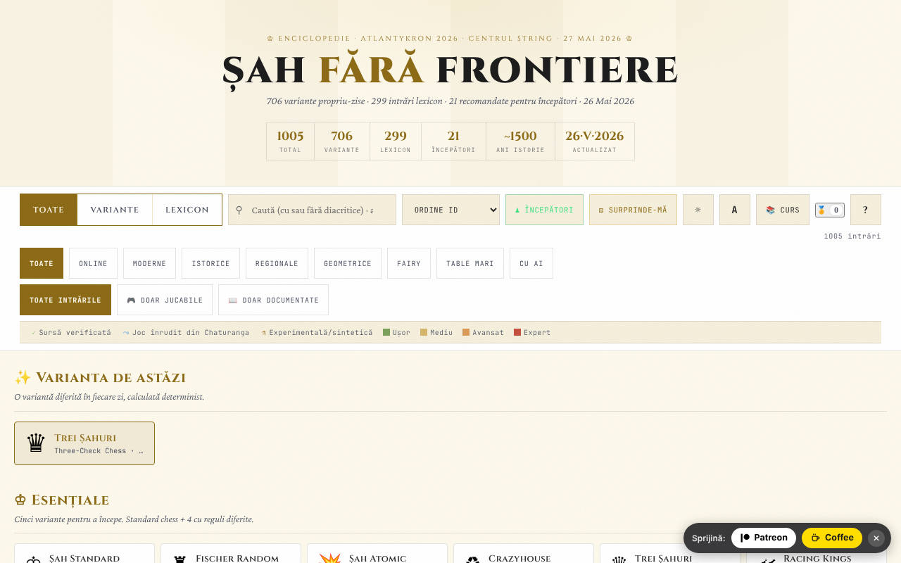

# Șah fără frontiere

Atlas/enciclopedie de variante de șah: 706 variante și 299 intrări de lexicon, cu motoare jucabile pentru o parte dintre ele.

**Live:** https://chiuta.github.io/Sah-fara-frontiere/

## Ce este

Șah fără frontiere este un atlas dintr-un singur fișier HTML (v14, mai 2026, realizat pentru atelierul Atlantykron 2026) cu 1005 intrări: 706 variante de șah (online, moderne, istorice, regionale, geometrice, fairy, pe table mari, cu AI) și 299 de termeni de lexicon (istorie, AI, jucători, deschideri). Potrivit secțiunii „Despre acest atlas", fișierul este generat dintr-un script Python și un JSON de date, fără dependențe la rulare, cu implementare în iterații asistate de AI.

## Funcții

- Căutare și filtre: Toate / Variante / Lexicon; categorii (Online, Moderne, Istorice, Regionale, Geometrice, Fairy, Table Mari, Cu AI); „Toate intrările", „Doar jucabile", „Doar documentate"; marcaje de sursă (sursă verificată, joc înrudit din Chaturanga, experimentală/sintetică) și niveluri de dificultate.
- Colecții curate: „Varianta de astăzi" (aleasă determinist), „Esențiale", „Exotice", „Geometrii noi".
- Butoane „Începători" și „Surprinde-mă" (variantă aleatoare).
- Fișă pentru fiecare intrare, cu „▶ Joacă" pentru variantele cu motor: tablă interactivă, „Reguli: ON", „AI" și „AI vs AI", „Anulează", „Reset", „Pas", „Flip", sunet, notație (CJK / WXF), ecran complet, export „PGN" și „FEN"; clasament ELO local.
- „Curs": parcurs ghidat de 7 zile și 17 realizări (insigne) deblocabile.
- „Export CSV (toate intrările)" și „Citează ca BibTeX"; buton „Link" pentru partajare.
- Tema închisă/deschisă, trei mărimi de text, zoom.

## Manual de utilizare

1. Folosește câmpul de căutare și filtrele (Toate, Variante, Lexicon, categorii) pentru a găsi o intrare; apasă pe o carte pentru a o deschide.
2. În fișă citește regulile; dacă există motor, apasă „▶ Joacă".
3. Scurtături de tastatură (din fereastra „?"): `/` focalizează căutarea; `R` variantă aleatoare; `B` variante pentru începători; `T` schimbă tema; `A` schimbă mărimea textului; `C` deschide parcursul ghidat; `?` ajutor; `Esc` închide ferestrele; `Enter` sau `Space` deschide cardul focalizat; `Tab` / `Shift+Tab` navigare.
4. „📚 Curs" deschide parcursul de 7 zile; progresul se salvează local, iar „Resetează progres" îl șterge.
5. În partidă poți exporta poziția sau partida cu „PGN" / „FEN".
6. „Despre acest atlas →" conține informații despre atlas, versiune și autor; de acolo se pot exporta intrările în CSV sau BibTeX.

## Confidențialitate și rețea

- Local: în `localStorage`, cu prefixul `sff:` — starea atlasului (`sff:state:v2`), parcursul (`sff:curriculum:v1`), tema, mărimea textului, sunetul, stilul notației și glifelor, insignele, statisticile jocurilor, ELO-ul jucătorului, starea jocului curent și marcajele „bun venit"/tur văzut.
- Rețea: în codul verificat nu există apeluri `fetch` sau scripturi/fonturi încărcate de pe gazde externe. Fișele conțin linkuri către surse (de exemplu Wikipedia, FIDE Handbook, Lichess, chessvariants.com), care se deschid doar dacă le apeși. Textul aplicației afirmă: „Funcționează offline, fără tracking, fără reclame".
- Motorul AI rulează local în browser.

## Rulare locală / offline

Descarcă `index.html` (aproximativ 1,9 MB) și deschide-l în browser; funcționează fără internet. Doar linkurile către surse externe necesită conexiune.

## Licență

Licența nu este încă declarată explicit în acest repository; vezi nota din aplicație. Atenție: aplicația conține indicații diferite — antetul codului menționează „TRADE-FREE + CC0 1.0", iar secțiunea de versiune menționează „CC-BY-SA 4.0".

## Autor

Alexio — Alexandru-Ionuț Chiuță, contact: alexio@trom.tf. Aplicația îl prezintă ca autor, dezvoltator și muzician, cu mențiuni pentru proiectul TROM, Editura Tornada și Centrul StrING.

## English summary

Șah fără frontiere is a single-file chess-variants atlas: 706 variants plus 299 lexicon entries, with search, filters, playable engines (local AI, PGN/FEN export, local ELO), a 7-day guided course, badges and CSV/BibTeX export. Everything runs locally; progress is kept in localStorage (`sff:` keys) and no external requests were found in the code. The licence statements inside the app are inconsistent (CC0 vs CC-BY-SA 4.0).
